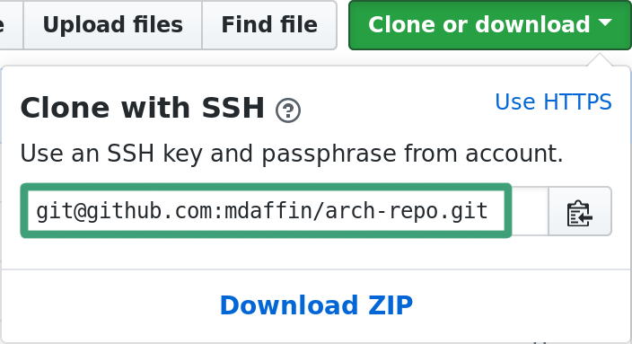

# Automating Arch Linux Part 1b: Hosting an Arch Linux Repository in a Hosted Git Repository

::: warning
This post is no longer being updated as I found too many limitations around git
repositories and storing larger packages inside them, quite often hitting the size
limitations for some packages. It currently makes use of `repose` but
`aurutils` is set to drop support for it at some point as there are a number of
issues with it and will eventually stop working. It should be possible to
use `repo-add` but this creates symlinks which need to be dealt with as they do
not work when accessed via the raw links.
:::

In this three-part series, I will show you one way to simplify and manage
multiple Arch Linux systems using a custom repository, a set of meta-packages and a
scripted installer. Each part is standalone and can be used by its self, but
they are designed to build upon and complement each other each focusing on a
different part of the problem.

- **Part 1:** Hosting an Arch Linux Repository in an [Amazon S3 Bucket] or _Hosted Git Repository_
- **Part 2:** [Managing Arch Linux with Meta Packages]
- **Part 3:** [Creating a Custom Arch Linux Installer]

[amazon s3 bucket]: /blog/archlinux-repo-in-aws-bucket/
[managing arch linux with meta packages]: /blog/archlinux-meta-packages/
[creating a custom arch linux installer]: /blog/archlinux-installer/

When you use Arch Linux for any length of time you start collecting sets of
[AUR] packages that you frequently use. Now, Arch Linux has loads of [AUR
helpers] that make managing AUR packages painless, but when you start using
arch on multiple systems it becomes annoying and time consuming to rebuild AUR
packages on each system. In this post, I will show you how to use an hosted git
repository to create a cheap, low maintenance Arch Linux repository. As well as
making use of the `aurutils` package to make building and upgrading AUR
packages a painless exercise.

You can use any git provider you wish, for example [GitLab] or [GitHub] the
only requirement is they have a public URL you can fetch the raw files from.
For this guide I will use GitHub.

[github]: https://github.com/
[gitlab]: https://gitlab.com/
[aur]: https://aur.archlinux.org/
[aur helpers]: https://wiki.archlinux.org/index.php/AUR_helpers

## Dependencies

We only require a few packages to get us going of which only `aurutils` needs to
be installed from AUR. It will be the only package we are required to
build and install manually.

- **[aurutils]**: a set of utilities that make it easy to manage/update a repository with
  AUR packages.
- **git**: to manage the git repository.
- **[repose]**: an alternative to `add-repo`, but makes deploying the repository easier
  inside a git repository. Aurutils automatically uses repose if it is installed and we
  will not explicitly use it. ^
- **base-devel**: needed to build aurutils and other packages.

To install all of these run the following.

```bash
sudo pacman -S --needed repose base-devel git
wget https://aur.archlinux.org/cgit/aur.git/snapshot/aurutils.tar.gz
tar -xf aurutils.tar.gz
cd aurutils
makepkg -sci
```

If you get the following error while running `makepkg`.

```bash
==> Verifying source file signatures with gpg...
    aurutils-1.5.3.tar.gz ... FAILED (unknown public key 6BC26A17B9B7018A)
==> ERROR: One or more PGP signatures could not be verified!
```

Simply download the missing key with the following before running `makepkg`
above.

```bash
gpg --recv-key 6BC26A17B9B7018A
```

[aurutils]: https://github.com/AladW/aurutils
[s3fs-fuse]: https://github.com/s3fs-fuse/s3fs-fuse
[repose]: https://github.com/vodik/repose

_^ We are using `repose` instead of `repo-add` as `repo-add` creates symlinks to
the database which do not always work inside raw links to repositories._

## Creating the Git Repository

Head over to [GitLab] and create a new repository.

 <!-- TODO smallimage -->

Give it an name and ensure that it is public. It needs to be public to allow
pacman to download packages from it without any kind of authentication.


And finally grab the clone URL for your new repository.



And clone it locally and create a directory to house your Arch Linux repository such
as `x86_64` - It is convention to separate Arch Linux repositories via the
architecture of the packages they contain.

```bash
git clone git@github.com:mdaffin/arch-repo.git
cd arch-repo
mkdir -p x86_64
```

## Aurutils - Building and Managing Packages

Aurutils contains a suite of utilities that can be used to manage a repository of AUR
packages. The two main utilities we will use are `aursearch`, which can search
AUR for packages that match a given pattern.

```bash
% aursearch aurutils
aur/aurutils 1.5.3-5 (55)
    helper tools for the arch user repository
aur/aurutils-git 1.5.3.r234.g15ef2ab-1 (5)
    helper tools for the arch user repository
```

And `aursync` which will download and build packages and ensure packages in the
repository are up to date.

For `aursync` to work, we need to add a repository to `/etc/pacman.conf`

```ini
[mdaffin]
SigLevel = Optional TrustAll
Server = https://raw.githubusercontent.com/mdaffin/arch-repo/master/x86_64
```

Give your repository a unique name by replacing `[mdaffin]` with something else.
Change the URL to that of your repositories raw link. You can get the raw link for
most hosted git providers by creating a file in the repository and viewing the raw
file, then just remove the filename form that URL.

Now we can create the repository and upload our first package to it. For this, we are
going to rebuild the aurutils package as it will be handy to have that stored
in our repository.

```bash
aursync --repo mdaffin --root x86_64 aurutils
```

Replace `mdaffin` with the name of your repository, this must match the section in
`/etc/pacman.conf`. Since we have a remote repository we need to tell `aursync` were
to place the files using `--root <dir>` pointing it to the directory we created
inside the git repository.

If all goes well you should end up with the package and arch repository database
inside the git repository.

```bash
% ls x86_64
aurutils-1.5.3-5-any.pkg.tar.xz  mdaffin.db  mdaffin.files
```

Finally we need to commit and push these changes.

```bash
git add x86_84
git commit -m "added aurutils"
git push
```

Now they packages should be available to download with pacman.

```bash
% sudo pacman -Syy
% pacman -Ss aurutils                                                              :(
mdaffin/aurutils 1.5.3-5 [installed]
    helper tools for the arch user repository
```

And that's it, you have created a repository inside a hosted git repository. You can
add more packages to this repository using the `aursync` command above.

To check for and update all the packages in the repository simply add `-u` to the
`aursync` command.

```bash
aursync --repo mdaffin --root x86_64 -u
```

And remember to commit and push when you are done.

## Wrapper Script

We can automate most of this with a simple wrapper script around `aursync`.
Simply save this script somewhere, replace the `CLONE_URL`, `GIT_BRANCH`,
`REPO_PATH` and `REPO_NAME` variables with your own and call it like you would
`aursync`: `./aursync_wrapper PACKAGE` or `./aursync_wrapper -u`.

This script will automatically clone and sync the git repository to
`~/.local/share/arch-repo/repo`.

```bash
#!/bin/bash -x
# Wraps aursync command that stores built packages inside a git repo
set -uo pipefail
trap 's=$?; echo "$0: Error on line "$LINENO": $BASH_COMMAND"; exit $s' ERR
shopt -s expand_aliases

CLONE_URL=git@github.com:mdaffin/arch-repo.git
GIT_BRANCH=master
REPO_PATH=x86_64
REPO_NAME=mdaffin

DATA_DIR="${XDG_DATA_HOME:-$HOME/.local/share/arch-repo}"
mkdir -p "${DATA_DIR}"
alias gitc='git -C "${DATA_DIR}/repo"'

if [[ -d "${DATA_DIR}/repo" ]]; then
    # DATA_DIR exists, reset and pull any changes
    gitc reset --hard
    gitc clean -xffd
    gitc checkout "${GIT_BRANCH}"
    gitc pull
else
    # DATA_DIR does not exist, so clone it
    git clone -b "${GIT_BRANCH}" "${CLONE_URL}" "${DATA_DIR}/repo"
fi

mkdir -p "${DATA_DIR}/repo/${REPO_PATH}"

aursync --repo "${REPO_NAME}" --root "${DATA_DIR}/repo/${REPO_PATH}" "$@"

if ! gitc status | grep "nothing to commit, working tree clean" &>/dev/null; then
    gitc add .
    gitc commit -m "aursync $@"
    gitc push
fi
```

## Conclusion

Unfortunately, there are some limitations with this approach, most git hosted
git repositories have a soft or hard limit on the repository size - typically
around 1GB which you can quickly exceed with a collection of packages. You also
need to make sure that when you prune packages you also squash your repo's
history or you won't actually be saving any space.

This approach is more stable on weak connections than relying on a network
mounted fuse file system as you are working locally and only syncing up changes
when you start or have finished. The files remain cached on your local system
but you do need to download all the files as a one-off when you first clone the
repository which can take a bit more time than using a networked file system.

Luckily it is easy to switch between the two methods as it just requires you to
download the repository and upload it somewhere else.

_[Discuss on Reddit]_

[discuss on reddit]: https://www.reddit.com/r/archlinux/comments/7zodod/hosting_an_arch_linux_repo_in_a_hosted_git/
