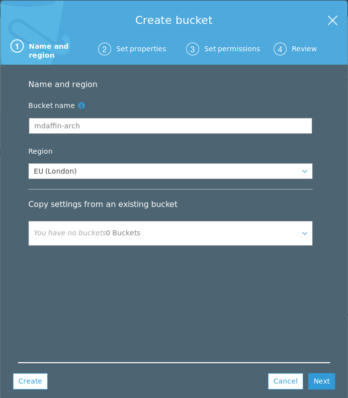
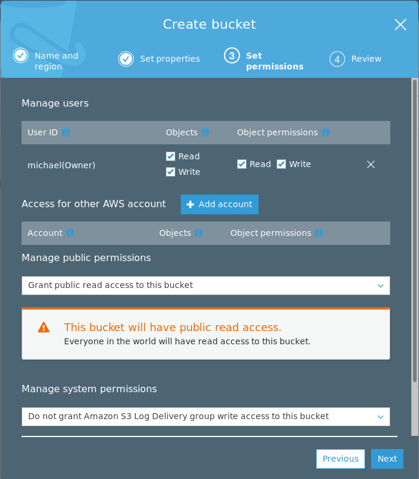
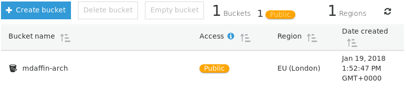
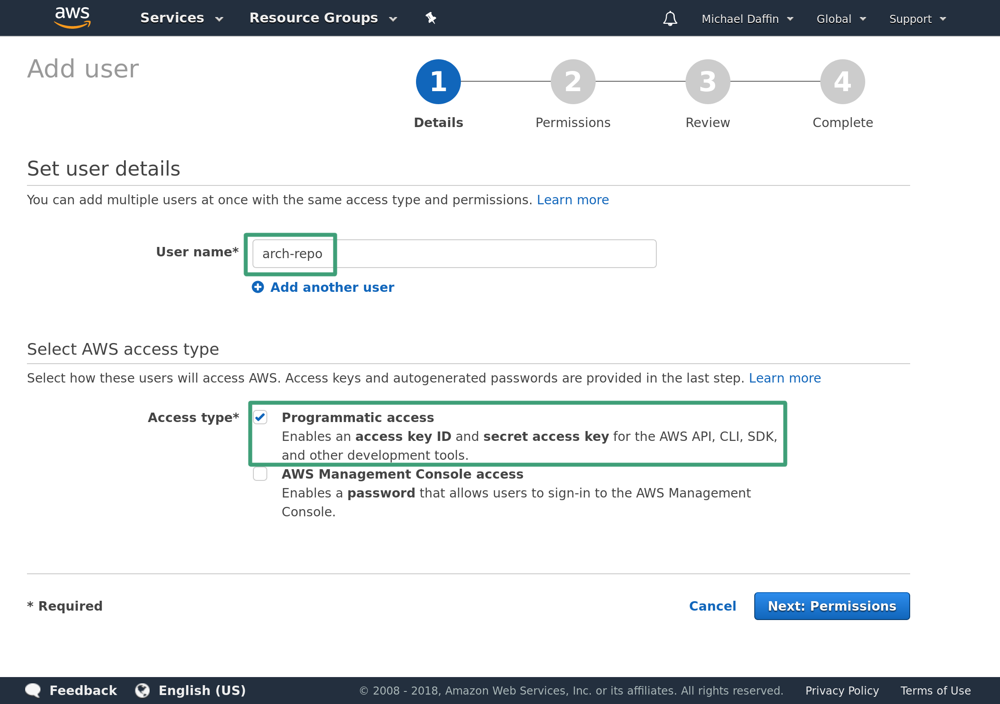
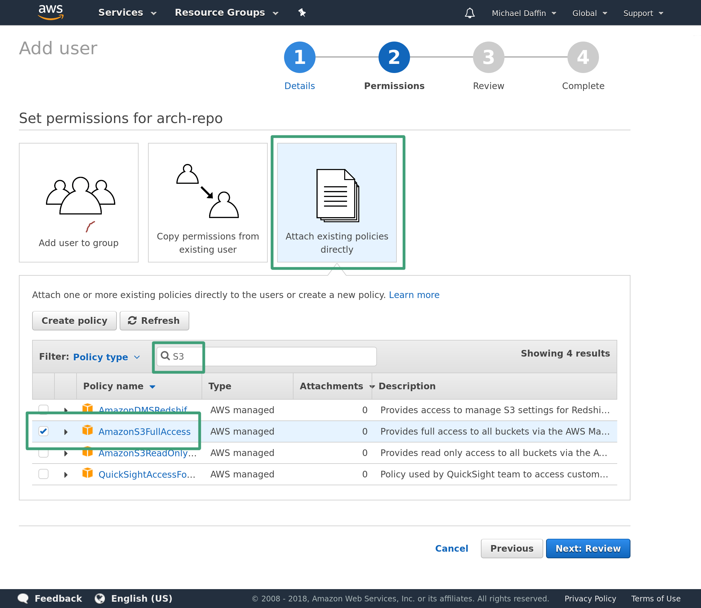
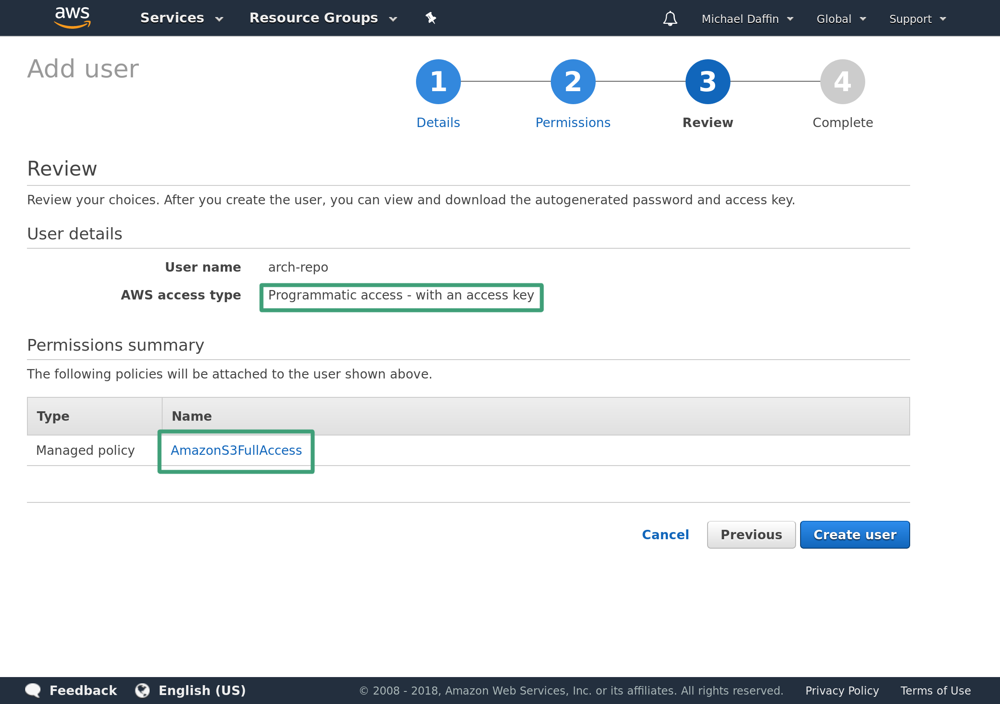
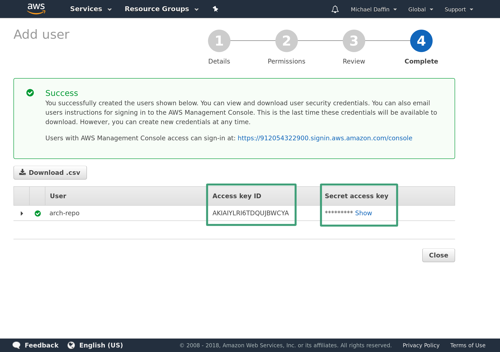

# Automating Arch Linux Part 1: Hosting an Arch Linux Repo in an Amazon S3 Bucket

::: tip Update on 2018-05-20
I have updated this guide to switch from `repose` and `s3fs` to `repo-add` and
`s3cmd` due to a number of limitation in `repose` and the fact that `aurutils`
is dropping support for it as well as some instabilities with `s3fs` on weaker
internet connections.
:::

In this three-part series, I will show you one way to simplify and manage
multiple Arch Linux systems using a custom repo, a set of meta-packages and a
scripted installer. Each part is standalone and can be used by its self, but
they are designed to build upon and complement each other each focusing on a
different part of the problem.

- **Part 1:** *Hosting an Arch Linux Repo in an Amazon S3 Bucket*
- **Part 2:** [Managing Arch Linux with Meta Packages]
- **Part 3:** [Creating a Custom Arch Linux Installer]

[Managing Arch Linux with Meta Packages]: /blog/archlinux-meta-packages/
[Creating a Custom Arch Linux Installer]: /blog/archlinux-installer/

When you use Arch Linux for any length of time you start collecting sets of
[AUR] packages that you frequently use. Now, Arch Linux has loads of [AUR
helpers] that make managing AUR packages painless, but when you start using
arch on multiple systems it becomes annoying and time consuming to rebuild AUR
packages on each system. In this post, I will show you how to use an Amazon S3
bucket to create a cheap, low maintenance Arch Linux repository. As well as
making use of the `aurutils` package to make building and upgrading AUR packages
a painless exercise.

::: danger
Although everything we are going to do in this post will fit inside the **AWS
free tier**, it **only lasts** for **12 months**. Make sure to **delete** any
**resources** you create once you are done to avoid an **unexpected charge**
from AWS way in the future. Even without the free tier, it should only cost no
more than a few dollars a month to maintain the bucket - even with a very large
repository. You can also use alternatives like Digital Oceans Spaces, Google
Cloud or a static file web server.
:::

[AUR]: https://aur.archlinux.org/
[AUR helpers]: https://wiki.archlinux.org/index.php/AUR_helpers


## Dependencies

We only require a few packages to get us going of which only `aurutils` needs to
be installed from AUR. It will be the only package we are required to
build and install manually.

* [aurutils]: a set of utilities that make it easy to manage/update a repo with
  AUR packages.
* [s3cmd]: a tool to upload and download files from a s3 bucket.
* base-devel: needed to build aurutils and other packages.

To install all of these run the following.

```bash
sudo pacman -S --needed s3cmd base-devel
wget https://aur.archlinux.org/cgit/aur.git/snapshot/aurutils.tar.gz
tar -xf aurutils.tar.gz
cd aurutils
makepkg -sci
```

If you get the following error while running `makepkg`.

```bash
==> Verifying source file signatures with gpg...
    aurutils-1.5.3.tar.gz ... FAILED (unknown public key 6BC26A17B9B7018A)
==> ERROR: One or more PGP signatures could not be verified!
```

Simply download the missing key with the following before running `makepkg`
above.

```bash
gpg --recv-key 6BC26A17B9B7018A
```

[aurutils]: https://github.com/AladW/aurutils
[s3cmd]: https://github.com/s3tools/s3cmd

## Creating the Amazon S3 Bucket

Sign in to [Amazon's console][Amazon S3] and head to the [Amazon S3] interface.
You will be required to enter your credit card details in order to create the
bucket, this should be free for the first year if you stay under 5GB of storage
and [fairly cheap][amazon pricing] after that.

Click on the create bucket button.

 <!-- TODO smallimage -->

Name your bucket and select the region you want to host it in.



Then click on Next twice to get to (3) Set permissions and make the bucket
public. This will allow anyone in the world to read the bucket and thus allows
`pacman` to download the packages anonymously.



After you should have one public bucket listed like so.




[Amazon S3]: https://s3.console.aws.amazon.com/s3/home?region=us-east-1
[amazon pricing]: https://aws.amazon.com/s3/pricing/

## Access Credentials

We now need to create an access key that has permissions to edit this bucket.
We can do this by creating a new restricted user that only have access to the
Amazon S3 buckets.

Head over to the [AWS IAM management console] and add a new user. Then enter
the username and ensure *Programmatic access* check box is selected.



Click Next to head to the permission page then *Attach existing policies
directly*. Search for *S3* and check *AmazonS3FullAccess*.



Click *Next* and on the review page double check it has *Programmatic access*
and *AmazonS3FullAccess*.



Click *Create User* to get the access key. Take note of the *Access key ID* as
well as the *Secret access key*. Ensure you save these somewhere, once you
leave this page you will not have access to the secret key through the AWS
console and will have to regenerate a new key.



Keep this key secret as it will give anyone with it the ability to
create/modify your buckets. If you lose the key or no longer require it then
head to the user page and remove it from the user.

Save it to `~/.s3cfg` in the form

```ini
[default]
access_key = <ACCESS_KEY>
secret_key = <SECRET_KEY>
```

And ensure it is only readable by your user

```bash
chmod 0600 ~/.s3cfg
```

[AWS IAM management console]: https://console.aws.amazon.com/iam/home#/users

## Aurutils - Building and Managing Packages

Aurutils contains a suite of utilities that can be used to manage a repo of AUR
packages. The two main utilities we will use are `aursearch`, which can search
AUR for packages that match a given pattern.

```bash
$ aursearch aurutils
aur/aurutils 1.5.3-5 (55)
    helper tools for the arch user repository
aur/aurutils-git 1.5.3.r234.g15ef2ab-1 (5)
    helper tools for the arch user repository
```

And `aursync` which will download and build packages and ensure packages in the
repo are up to date.

For `aursync` to work, we need to add a repo to `/etc/pacman.conf`

```ini
[mdaffin]
SigLevel = Optional TrustAll
Server = https://s3.eu-west-2.amazonaws.com/mdaffin-arch/repo/x86_64/
```

Give your repo a unique name by replacing `[mdaffin]` with something else.
Change the URL to that of your bucket/repo path. You can get the exact URL by
creating a file inside the directory and getting a link to that file from the
[Amazon Web Console].

Now we can create the repo and upload our first package to it. For this, we are
going to rebuild the aurutils package as it will be handy to have that stored
in our repo. But first we need to create a directory to store the repo as well
as initialise the database files.

```bash
$ mkdir -p local-repo
$ repo-add local-repo/mdaffin.db.tar.xz
$ aursync --repo mdaffin --root local-repo aurutils
```

Replace `mdaffin` with the name of your repo, this must match the section in
`/etc/pacman.conf`. Since we have a remote repo we need to tell `aursync` were
to place the files using `--root <dir>` pointing it to a local package cache
(exact location does not matter).

If all goes well you should end up with the package and repo database inside
the cache directory.

```bash
$ ls local-repo
aurutils-1.5.3-5-any.pkg.tar.xz  mdaffin.db  mdaffin.files
```

To check for and update all the packages in the repo simply add `-u` to the
`aursync` command.

```bash
$ aursync --repo mdaffin --root local-repo -u
```

[amazon web console]: https://s3.console.aws.amazon.com/s3/home

## Uploading to the S3 Bucket

Now that we have the packages locally we need to upload them to the bucket.
This is where `s3cmd` comes in, we can tell it to take all the files in our
local cache and upload them to a given directory in the bucket. There are a
couple ways to do this, first is the `put` or `cp` methods which will copy up
any files we give them, much like the local `cp` command. But as our local
cache grows we will just waste bandwidth and operations uploading the same
unchanged files over and over again. This is where the `sync` command comes in,
much like `rsync` it checks the remote to see if the file already exists and if
it is different form the local copy. Only if it is missing or differs will it
upload the new files.

There is one problem, S3 buckets do not support symlinks, which `repo-add`
creates for us. We need to tell it to explicitly copy the files the symlinks
point to with the `--follow-symlinks` flag. And lastly, we need to set the
public permissions on any file we upload with the `--acl-public` flag.

```bash
$ s3cmd sync --follow-symlinks --acl-public local-repo/ s3://mdaffin-arch/repo/x86_64/
```

The packages should now be visible on the Amazon Web Console (or via `s3cmd ls
s3://...`) and installable via `pacman`.

```bash
$ sudo pacsync mdaffin
$ pacman -Ss aurutils
mdaffin/aurutils 1.5.3-5 [installed]
    helper tools for the arch user repository
```

And that's it, you have created a repo inside an Amazon S3 bucket. You can add
more packages to this repo using the `aursync` command above.

## Fetching Remote Changes

If you want to manage this from multiple computers then you need a way to sync
up the repos on each system. This can easily be done by reversing the sync
command. For this we do not need the `--follow-symlinks` flag as there are no
symlinks in the bucket nor the `--acl-public` flag as it does not make sense
for a local file. But the `--delete-removed` is useful for clearing up files
that have been deleted form the remote bucket to stop them from being restored
when you next push changes.

```bash
$ s3cmd sync --delete-removed s3://mdaffin-arch/repo/x86_64/ local-repo/ 
```

But this will download all files from the remote which can grow quite large
over time. We really only want to add or remove a few packages at a time and it
is far more efficient to only download the repo (if it has changed), make any
changes to it then upload any required files followed by the changed database.
With this we can also only download a single copy of the database, rather than
both copies and manually create the symlinks. Note that we do not need the
`--delete-removed` flag as the database files should always exist both locally
and remotely.

```bash
$ s3cmd sync s3://mdaffin-arch/repo/x86_64/mdaffin.{db,files}.tar.xz local-repo/
$ ln -sf local-repo/mdaffin.db.tar.xz local-repo/mdaffin.db
$ ln -sf local-repo/mdaffin.files.tar.xz local-repo/mdaffin.files
```

## Removing a package

If you are keeping a full copy of the remote repo locally you can simply
remove the package and push the changes with the `--delete-removed` flag.

```bash
$ repo-remove local-repo/mdaffin.db.tar.xz aurutils
$ rm local-repo/aurutils-*.pkg.tar.xz
$ s3cmd sync --delete-removed --follow-symlinks --acl-public local-repo/ s3://mdaffin-arch/repo/x86_64/
```

However, this cannot be done if we are only downloading the database as we will
be missing more of the packages and thus end up deleting most of our remote
repo. Instead we should update the local cache to remove the package, push only
the repository files then tell the remote to delete the package.

```bash
$ repo-remove local-repo/mdaffin.db.tar.xz aurutils
$ s3cmd sync --follow-symlinks --acl-public local-repo/mdaffin.{db,files}{,.tar.xz} s3://mdaffin-arch/repo/x86_64/
$ s3cmd rm "s3://mdaffin-arch/repo/x86_64/aurutils-*.pkg.tar.xz"
```

## Wrapper Scripts

We can automate most of this with a simple wrapper script around `aursync`.
Simply save this script somewhere, replace the `REMOTE_PATH` and
`REPO_NAME` variables with your own and call it like you would `aursync`:
`./aursync_wrapper PACKAGE` or `./aursync_wrapper -u`.

```bash
#!/bin/bash -x
# Wraps aursync command to mount an amazon s3 bucket which contains a repository
set -uo pipefail
trap 's=$?; echo "$0: Error on line "$LINENO": $BASH_COMMAND"; exit $s' ERR

REMOTE_PATH=s3://mdaffin-arch/repo/x86_64
LOCAL_PATH=$HOME/.local/share/arch-repo
REPO_NAME=mdaffin

mkdir -p "$LOCAL_PATH"

## Sync remote DB to local ##
s3cmd sync "$REMOTE_PATH/$REPO_NAME".{db,files}.tar.xz "$LOCAL_PATH/"
ln -sf "$REPO_NAME.db.tar.xz" "$LOCAL_PATH/$REPO_NAME.db"
ln -sf "$REPO_NAME.files.tar.xz" "$LOCAL_PATH/$REPO_NAME.files"

## Clean up older packages that may or may not have been deleted from the
## remote so that we do not reupload them
rm -f "$LOCAL_PATH/"*.pkg.tar.xz

aursync --repo "$REPO_NAME" --root "$LOCAL_PATH" "$@"

## Sync local DB to remote ##
s3cmd sync --follow-symlinks --acl-public \
    "$LOCAL_PATH/"*.pkg.tar.xz \
    "$LOCAL_PATH/$REPO_NAME".{db,files}{,.tar.xz} \
    "$REMOTE_PATH/"
```

And to remove a package use the follow script and pass it the package you want
to remove: `./del-from-repo aurutils`

```bash
#!/bin/bash
# Wraps aursync command to mount an amazon s3 bucket which contains a repository
set -uo pipefail
trap 's=$?; echo "$0: Error on line "$LINENO": $BASH_COMMAND"; exit $s' ERR

package=${1:?"Missing package"}

REMOTE_PATH=s3://mdaffin-arch/repo/x86_64
LOCAL_PATH=$HOME/.local/share/arch-repo
REPO_NAME=mdaffin

mkdir -p "$LOCAL_PATH"

## Sync remote DB to local ##
s3cmd sync "$REMOTE_PATH/$REPO_NAME".{db,files}.tar.xz "$LOCAL_PATH/"
ln -sf "$REPO_NAME.db.tar.xz" "$LOCAL_PATH/$REPO_NAME.db"
ln -sf "$REPO_NAME.files.tar.xz" "$LOCAL_PATH/$REPO_NAME.files"

repo-remove "$LOCAL_PATH/$REPO_NAME.db.tar.xz" "$@"
s3cmd sync --follow-symlinks --acl-public "$LOCAL_PATH/$REPO_NAME".{db,files}{,.tar.xz} "$REMOTE_PATH/"
for package in "$@"; do
    s3cmd rm "$REMOTE_PATH/$package-*.pkg.tar.xz"
done
```

## Amazon AWS S3 Alternatives

If you don't wish to use Amazon buckets there are some alternatives such as
[Digital Ocean Spaces] or [Google Cloud Buckets] that can be used in place. Some
are compatible with the S3 API and thus can be used with the instructions above
while others require a different way to sync the changes. For example, if you
have a static file server some where you can use `rsync` in place of most
`s3cmd` with the relevant flags set.

[Digital Ocean Spaces]: https://m.do.co/c/8fba3fc95fef
[Google Cloud Buckets]: https://cloud.google.com/storage/

*[Discuss on Reddit]*

[Discuss on Reddit]: https://www.reddit.com/r/archlinux/comments/7v7g4w/managing_multiple_arch_linux_systems_with/
