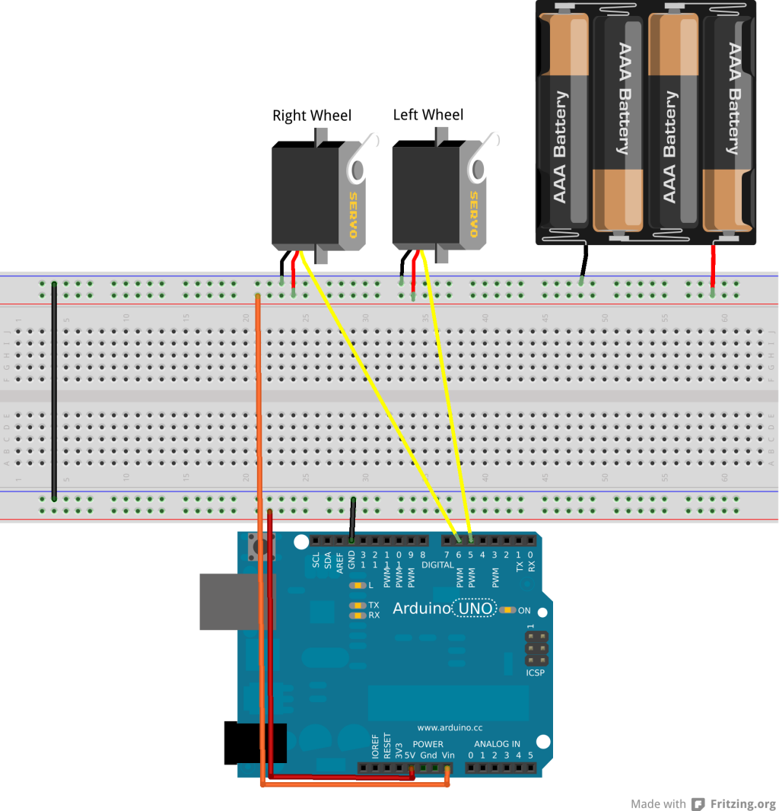
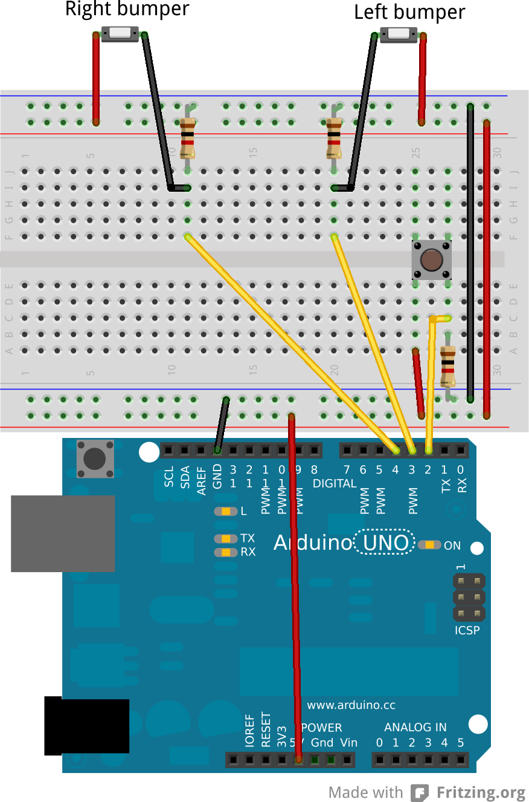
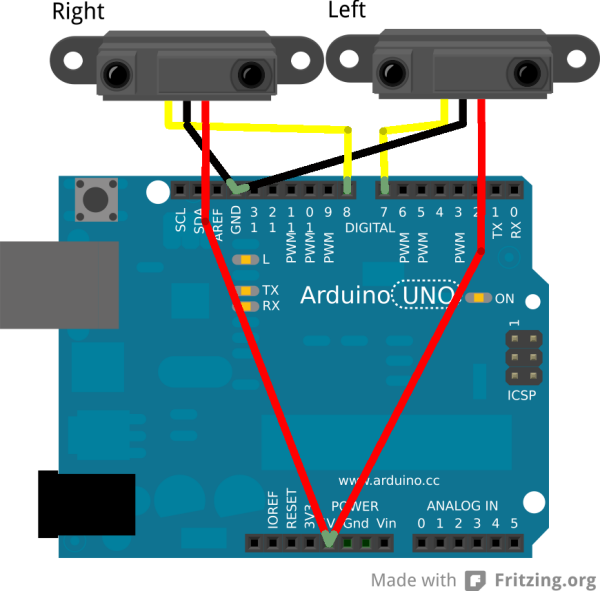
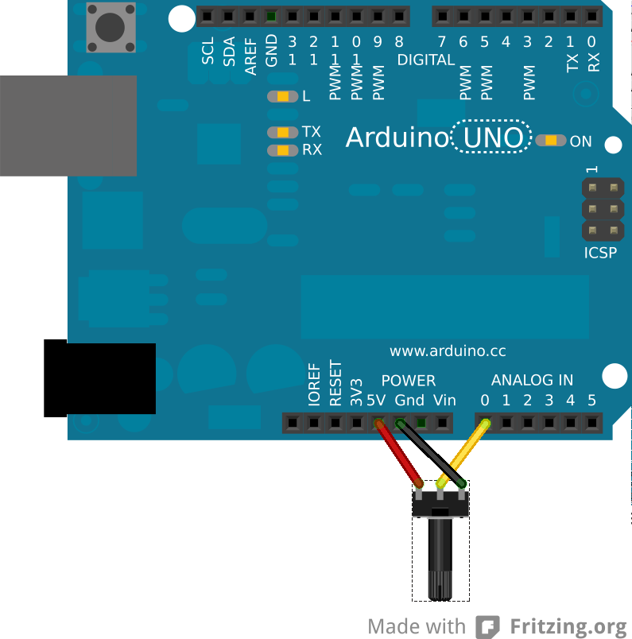

---
aliases:
  - /arduino-powered-rover/
  - /posts/arduino-powered-rover/
date: "2012-10-24T00:00:00Z"
description: A simple arduino powered robot
slug: arduino-powered-rover
tags:
  - arduino
  - robotics
---

# Arduino Powered Rover

Over the past couple of weeks I have been developing an Arduino powered
autonomous rover.

## The Hardware

The rover consists of the following hardware all fairly cheap and readily
available;

- [Arduino UNO](http://proto-pic.co.uk/arduino-uno/) or [Arduino pro mini 5v](https://proto-pic.co.uk/arduino-pro-mini-328-5v-16mhz-new/)\*
- [Potentiometer](http://proto-pic.co.uk/trimpot-10k-with-knob/)
- [2 bumper/latch switches](http://proto-pic.co.uk/omron-snap-action-switch/)
- 1 [Momentary switch](http://proto-pic.co.uk/momentary-push-button-switch-12mm-square/)
- 2 [Continuous Rotation Servo](http://www.hobbytronics.co.uk/springrc-sm-s4303r?keyword=servo)\*\*
- [2 GP2Y0D805Z0F Digital Distance Sensor](http://www.hobbytronics.co.uk/sensors/sensors-proximity/sharp-distance-sensor-5cm)
- 4 AA batteries and [holder](https://proto-pic.co.uk/battery-holder-4xaa-square/)\*\*\*
- 3 [1k resistor](https://proto-pic.co.uk/0-25w-carbon-film-resistor-pack-of-20/)
- A proto board or bread board
- Some wires and connectors
- Something to mount everything on\*\*\*\*

\* I started out with the UNO but later switched to the pro mini as it is
easier to power. Most other Arduinos should also work.  
\*\*You can buy continuous rotation servos, or you can modify normal servos for
continuous use. There are lots of guides out there on how to do this and this
guide will not cover this conversion.  
\*\*\*Or any ~5v power supply  
\*\*\*\* I used a sheet of expanded PVC but any rigid workable material should do.

## The Circuits

The circuits are basic, below is a breakdown of each section. I found the
Arduino UNO fairly annoying to power with the servos, since it is recommended to
have 7v+ to power the Arduino on the `Vin` pin and the servos are rated at 6v max.
I solved this by connecting the battery directly to the USB port on the Arduino
UNO and later switch to a 5V pro mini.

### The Power Supply

I had some trouble with the power supply on the Arduino UNO in that the Arduino
UNO is recommended to be powered by 7-12v via the `Vin` pin or the 5.5in power
plug. But the servos are rated at 4-6v and cannot be powered by the Arduino
`Vout` pins as they draw too much current.

I solved this on the Arduino by hacking up a an old USB B cable and using that
to power the Arduino UNO from a 5-6v power supply (4 AA batteries). Later on I
switched to the Arduino pro mini 5v, which supports 5-12v on the RAW pin.

### The Servos

The servos control the rovers movement. They should be powered directly from
the power source (4-6v) rather the from the Arduino as they can draw more
current then the Arduino can provide which can cause it to randomly reset. The
ground pins should be connected to the power source as well as the Arduino's
ground pins. The left servo to pin 5 on the Arduino's digital pins and the
right servo to pin 6.

 <!-- TODO width=288, height=300,  -->

### The Bumpers and Switch

The Switch is used to start/stop the rover and the bumpers are used in object
avoidance. One end of the switch and bumpers should be connected to the
ardunio's +5v pin and the other end to the Arduino's digital pins 2 (switch), 3
(left bumper) or 4 (right bumper) as well as through a 1k resistor to ground.

 <!-- TODO width=198, height=300,   -->

### The Range Finders

The range finders are used to detect table edges to avoid falling off surfaces
and should be mounted facing down at the front of the rover. I used an uncommon
ir range finders in that they do not report the distance back, but instead
drive the input pins high if there is an object within 5cm or low otherwise.
This makes the code much simpler since we only really care about this cutoff
point. You could replace these with normal range finders, but you would have
to modify the code to make use of them (I recommend the
[NewPing](http://code.google.com/p/arduino-new-ping/) library if you do decide
to use them).

The power pins should be connected to the Arduino's +5v pins and the ground to
the ground pins. The left range finder to the digital pin 7 and the right one
to digital pin 8.

 <!-- TODO width=300, height=295,  -->

### The Potentiometer

The potentiometer is used to control the speed of the over. Its outer pins can
be directly connected to the Arduino's ground and +5v power supply and the
central pin to the Arduino's analog pin 0.

 <!-- TODO width=296, height=300,  -->

### The LEDs

You can optionally connect two LEDs from pins 12 and 13 to ground, or use the
LED built into the Arduino's 13th pin which shows when the rover is running or
not. The 12th pin is mostly used for debugging and is not needed.

## The Software

The code for this project is available on [my GitHub
account](https://github.com/mdaffin/ArduinoRover). And can easily be built with

```bash
mkdir build
cd build
cmake ..
make
make rover-upload # This step requires the Arduino to be plugged into the computer
```

The code should be built then uploaded to the Arduino and the rover should start
moving when you hit the switch (and the LED on pin 13 should light up when it is
moving), press it again to stop it. If the led lights up but it doesn't start
moving, make sure the potentiometer isn't set to its minimum position.

## Conclusion

You should now have a fully functional rover capable of avoiding obstacles and
table edges that can easily be expanded upon. Some ideas for expansions:

- Add a [line
  sensor](http://proto-pic.co.uk/qre1113-line-sensor-breakout-digital/) to make
  the rover follow paths on the floor
- Add ranger finders as bumpers
- Add some LRDs to make the rover follow lights
- Create a remote control using IR emitter/detector
- Create a remote control using XBee modules

If you would like to see me attempt any of these or any other idea you have or
just want help creating your own feel free to contact me and I will see what I
can do.
