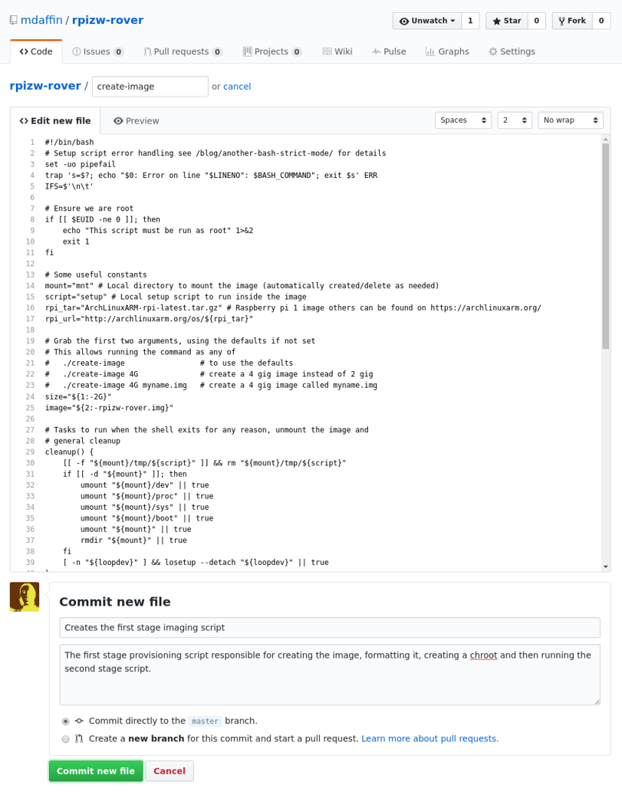
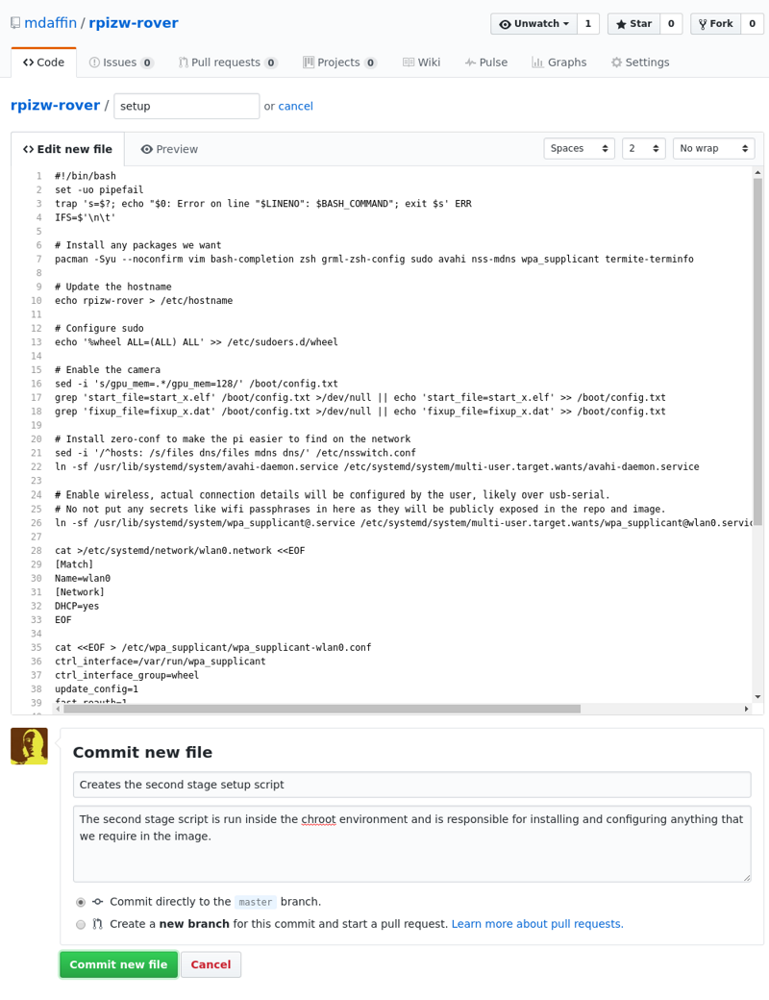
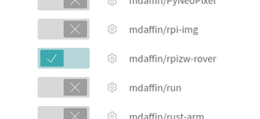
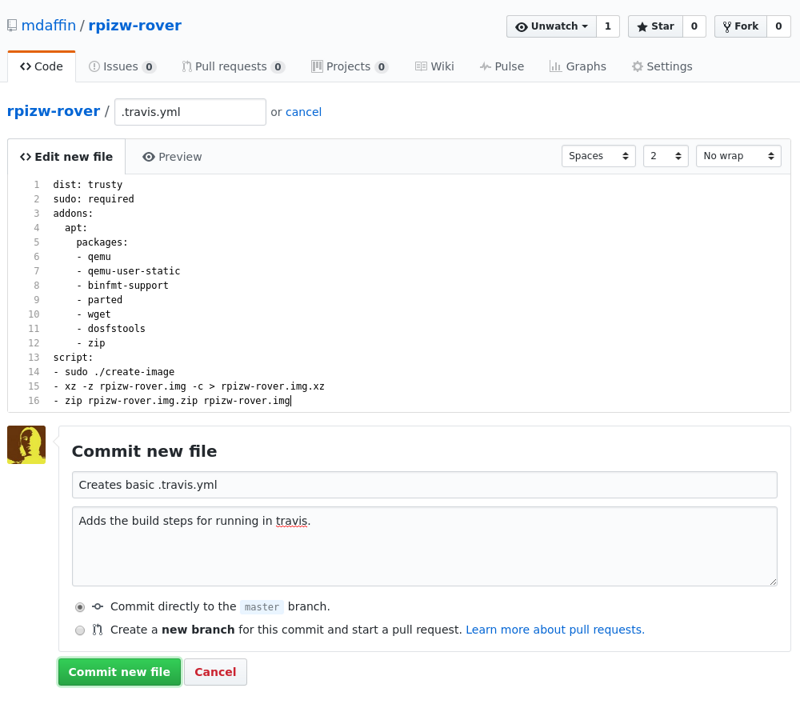
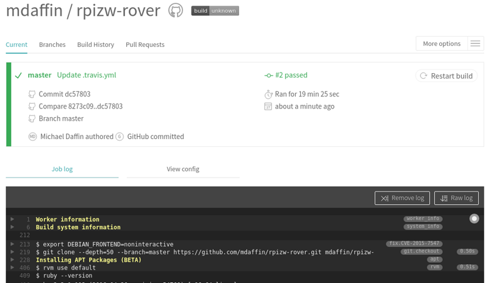
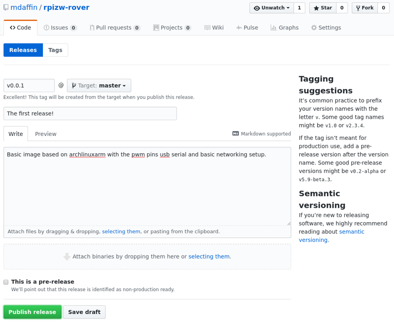
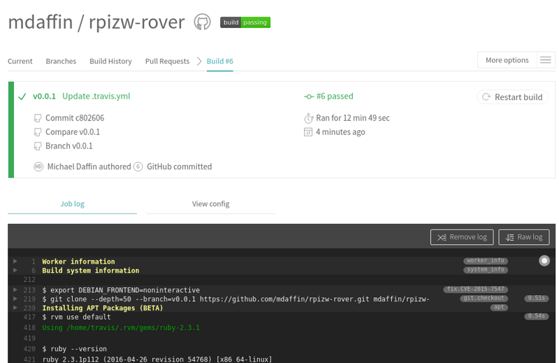
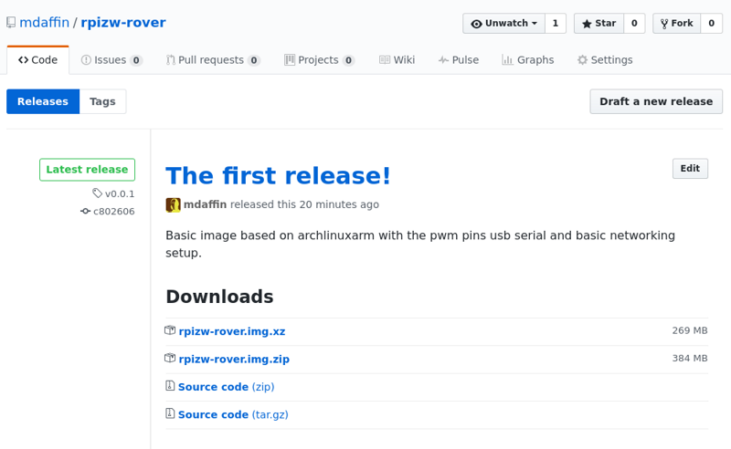

# Customising Raspberry Pi Images with Github and Travis

Over the coming months I am goring to be building upon my [raspberry pi
rover](/blog/pi-zero-w-rover-setup) and over this
time I will be needing to change and update the image quite often. I have always
been in favour of automating setup rather then taking repeated backups/snapshots
of raspberry pi images (as well as other things). So I figured I would start by
fully automating the creation and publishing of the raspberry pi images and
write up how I accomplished this.

A large amount of this work has already been covered in my post on [setting up
archlinuxarm on the raspberry pi](/blog/raspberry-pi-archlinuxarm-setup). This post will look
at taking the commands covered in that post and getting them to run in travis
via a github repo and publishing the image as to a release on github. Everything
in this post can be done for free using public repos and you only require an
account on github and travis (which you can login to through your github
account).

## Github Repo

Head over to [github.com](https://github.com), sign up or login and create a
[new public repo](https://github.com/new). The repo needs to be public to take
advantage of the free build on travis for open source projects, other wise you
need to pay for a private plan on both github and travis. If you wish to keep it
private you might want to look at [gitlab](https://gitlab.com/users/sign_in)
instead which offer free private repos and an integrated ci system (if there is
interest I may do a blog post on doing this with gitlab). I recommend checking
the "add a readme" checkbox to create a non empty repo, this will allow you to
create/edit files directly on github. You can also optionally add a license and
a gitignore file for the language you want might want to use.


## First stage script: `create-image`

This script is responsible for the first stage of creating the custom image and
involves allocating a file, formatting it, installing the base system and
prepping the `chroot` for the second stage. Create a new file called `create-image`
(no extension) in the root of your git repo (either clone it locally or add it
through the github interface)


with the following contents.

```bash
#!/bin/bash
# Setup script error handling see https://disconnected.systems/blog/another-bash-strict-mode for details
set -uo pipefail
trap 's=$?; echo "$0: Error on line "$LINENO": $BASH_COMMAND"; exit $s' ERR
IFS=$'\n\t'

# Ensure we are root
if [[ $EUID -ne 0 ]]; then
    echo "This script must be run as root" 1>&2
    exit 1
fi

# Some useful constants
mount="mnt" # Local directory to mount the image (automatically created/delete as needed)
script="setup" # Local setup script to run inside the image
rpi_tar="ArchLinuxARM-rpi-latest.tar.gz" # Raspberry pi 1 image others can be found on https://archlinuxarm.org/
rpi_url="http://archlinuxarm.org/os/${rpi_tar}"

# Grab the first two arguments, using the defaults if not set
# This allows running the command as any of
#   ./create-image                 # to use the defaults
#   ./create-image 4G              # create a 4 gig image instead of 2 gig
#   ./create-image 4G myname.img   # create a 4 gig image called myname.img
size="${1:-2G}"
image="${2:-rpizw-rover.img}"

# Tasks to run when the shell exits for any reason, unmount the image and
# general cleanup
cleanup() {
    [[ -f "${mount}/tmp/${script}" ]] && rm "${mount}/tmp/${script}"
    if [[ -d "${mount}" ]]; then
        umount "${mount}/dev" || true
        umount "${mount}/proc" || true
        umount "${mount}/sys" || true
        umount "${mount}/boot" || true
        umount "${mount}" || true
        rmdir "${mount}" || true
    fi
    [ -n "${loopdev}" ] && losetup --detach "${loopdev}" || true
}
trap cleanup EXIT

# Download archlinux arm only if we have not already done so
[ ! -f "${rpi_tar}" ] && wget "${rpi_url}"

# Create, partition and format the image
fallocate -l "${size}" "${image}"
loopdev=$(losetup --find --show "${image}")
parted --script "${loopdev}" mklabel msdos
parted --script "${loopdev}" mkpart primary fat32 0% 100M
parted --script "${loopdev}" mkpart primary ext4 100M 100%
bootdev=$(ls "${loopdev}"*1)
rootdev=$(ls "${loopdev}"*2)
mkfs.vfat -F32 ${bootdev}
mkfs.ext4 -F ${rootdev}

# Mount the image
[ ! -d "${mount}" ] && mkdir "${mount}"
mount "${rootdev}" "${mount}"
[ ! -d "${mount}/boot" ] && mkdir "${mount}/boot"
mount "${bootdev}" "${mount}/boot"

# Install archlinuxarm to the image
tar -xpf "${rpi_tar}" -C ${mount} 2> >(grep -v "Ignoring unknown extended header keyword")

# Copy our installation script to the mount so it can be run in the chroot
install -Dm755 "${script}" "${mount}/tmp/${script}"

# Prep the chroot
mount -t proc none ${mount}/proc
mount -t sysfs none ${mount}/sys
mount -o bind /dev ${mount}/dev
rm ${mount}/etc/resolv.conf
cp /etc/resolv.conf ${mount}/etc/resolv.conf
cp /usr/bin/qemu-arm-static ${mount}/usr/bin/

# Run the setup script inside the chroot
chroot ${mount}  "/tmp/${script}"
```

Then commit the new file.



You can later modify the script to copy any other resources (such as additional
binaries or configs) to the image in the same way we copied the script to the
`chroot`.

## Second stage script: `setup`

This script is the second and final stage of creating the image. It is what runs
inside the `chroot` environment setup in the first stage and is where we can
truly customise the image. Create another file in the root of your git repo
called `setup` (again, no extension) with the following contents.

```bash
#!/bin/bash
set -uo pipefail
trap 's=$?; echo "$0: Error on line "$LINENO": $BASH_COMMAND"; exit $s' ERR
IFS=$'\n\t'

# Install any packages we want
pacman -Syu --noconfirm vim bash-completion zsh grml-zsh-config sudo avahi nss-mdns wpa_supplicant termite-terminfo

# Update the hostname
echo rpizw-rover > /etc/hostname

# Configure sudo
echo '%wheel ALL=(ALL) ALL' >> /etc/sudoers.d/wheel

# Enable the camera
sed -i 's/gpu_mem=.*/gpu_mem=128/' /boot/config.txt
grep 'start_file=start_x.elf' /boot/config.txt >/dev/null || echo 'start_file=start_x.elf' >> /boot/config.txt
grep 'fixup_file=fixup_x.dat' /boot/config.txt >/dev/null || echo 'fixup_file=fixup_x.dat' >> /boot/config.txt

# Install zero-conf to make the pi easier to find on the network
sed -i '/^hosts: /s/files dns/files mdns dns/' /etc/nsswitch.conf
ln -sf /usr/lib/systemd/system/avahi-daemon.service /etc/systemd/system/multi-user.target.wants/avahi-daemon.service

# Enable wireless, actual connection details will be configured by the user, likely over usb-serial.
# No not put any secrets like wifi passphrases in here as they will be publicly exposed in the repo and image.
pacman -S --noconfirm wpa_supplicant wpa_actiond ifplugd crda dialog
ln -sf /usr/lib/systemd/system/netctl-auto@.service /etc/systemd/system/multi-user.target.wants/netctl-auto@wlan0.service
ln -sf /usr/lib/systemd/system/netctl-ifplugd@.service /etc/systemd/system/multi-user.target.wants/netctl-ifplugd@eth0.service

# Enable the usb serial, this will make it easier to add any wifi credentials on the pi zero (will not work on other models).
grep 'dtoverlay=dwc2' /boot/config.txt >/dev/null || echo 'dtoverlay=dwc2' >> /boot/config.txt
grep 'modules-load=dwc2,g_serial' /boot/cmdline.txt >/dev/null || sed -i 's/.*rootwait.*/& modules-load=dwc2,g_serial/' /boot/cmdline.txt
ln -sf /usr/lib/systemd/system/getty@ttyGS0.service /etc/systemd/system/getty.target.wants/getty@ttyGS0.service

# Enable hardware pwm
grep 'dtoverlay=pwm-2chan,pin=12,func=4,pin2=13,func2=4' /boot/config.txt >/dev/null || echo 'dtoverlay=pwm-2chan,pin=12,func=4,pin2=13,func2=4' >> /boot/config.txt

# Set zsh as the default shell for root and alarm
chsh -s /usr/bin/zsh root
chsh -s /usr/bin/zsh alarm
touch /root/.zshrc
touch /home/alarm/.zshrc
chown alarm. /home/alarm/.zshrc
```

This is the script used to setup my [pi rover](/blog/pi-zero-w-rover-setup) and
you should customise it to suit your application. When you are done commit the
new file.



You can test run these scripts locally if you are running linux, or by using
[Vagrant](https://www.vagrantup.com/) as mentioned in my [previous
post](/blog/raspberry-pi-archlinuxarm-setup#prerequisites)
or just wait to run it inside travis.

## Travis

Now its time to sign up to [travis](https://travis-ci.org) (you can use your
github account to do this). Ensure the account is linked and synced to your
github account then enable your repo in the account settings. You can read more
about getting started with travis
[here](https://docs.travis-ci.com/user/for-beginners).



Now head back to github and create a travis yaml file in the root of your repo
called `.travis.yml` (the leading dot `.` is important, do not miss it off).

```yaml
dist: trusty
sudo: required
addons:
  apt:
    packages:
    - qemu
    - qemu-user-static
    - binfmt-support
    - parted
    - wget
    - dosfstools
    - zip
script:
- sudo bash ./create-image
- xz -z rpizw-rover.img -c > rpizw-rover.img.xz
- zip rpizw-rover.img.zip rpizw-rover.img
```



Once you have saved, committed and push (if you have a local clone) travis will
automatically start building your image. You can follow the build on the travis
site including a full build log, note that it can take more then 10 minutes to
complete (mostly due to the compression steps). If everything has gone write you
should end up with a green build indicating everything has run successfully. If
not you can inspect the build logs to find out why it failed. Note that we also
compress the image here, this will reduce the size of the image we store and
need to download at the cost of taking a bit longer to build. It is compress it
to two different formats, `xz` which produces smaller images and `zip` which is
more portable (ie for windows users).



Now that we are able to build an image we must tell travis to upload the it back
to github as a release. To do this we need to create an api key and encrypt it
and include it in the `.travis.yml` file. The simplest way to do this is to
[install ruby](https://www.ruby-lang.org/en/documentation/installation/) then
the travis cli tool. Unfortinutlly you need to checkout your build locally to
run these commands, but this is the only step your are required to do this, and
you only need to do it once per repo. Windows (and mac) users can use the
[github desktop app](https://desktop.github.com/) to do this.

After you have ruby installed and a local clone run the following to install the
travis cli tool.

```bash
gem install travis
```

Then you can setup release with

```bash
travis setup releases
> Username: mdaffin
> Password for mdaffin:
> File to Upload: rpizw-rover.img.xz
> Deploy only from mdaffin/rpizw-rover? |yes| yes
> Encrypt API key? |yes| yes
```

If you have trouble with this consult the travis documentation on [setting up
github releases](https://docs.travis-ci.com/user/deployment/releases/).

This will add something like the following to your `.travis.yml` file locally.

```yaml
deploy:
  provider: releases
  api_key:
    secure: TzZpsusZ/P/adlSUL1wonxAF6LvQ4j+JcKLTmr9bz3t7KLc7dY3E248EjEqMkTbB8+1SPrwaLbIPlc7ammsu+vRKelVJLNjIQrs2gZ1ZTBPxF9kZxvorpbM/dYrend+7ffNcfdej1Ef+jGD9Wpd5DG2qwPoDniNDVTkCVISJTCGBob/z7DMM9nf7NkY9Z+OhLrrBFi96P18NX8jqFhvvAtdnVk5tr6j7MCspCcqN31cwEOUzFuRtTqGthwDwY8gSo9TejDCw6Cf47MGYA7hxHKO20W9aqHyczoTy2/t6uiIKkYH7MymoREi7O6rgTBaUAybLmiqJ+g+cE8dHjnPDdvse96Rv0PLMTy+7aZLVjV7NNGKVrgKOWrCDXqwlH321YQc9UYraOvk3aJU3Q9+FHf7QO3D9JPOkICo5Yl7svAX4XHw+vQPa2em/PObmbUGvw+WMjhoqfYTBjLS/LCYMFU/foxxec5cB37fHXfzXgtdEHzq/FJ/2zSj0uJLc2FBejL/ukEHHaNWGQJuvPTNL47iYmTj4I1G954o9ThT21RjjqeDmY1+dAz3ztVapgQIgSijJQfZ/Qc4rW1VbPMuKF09MmkGMnwaThmFStdeSX3PrtMdB6zs+8W74TPOw5l7urOZSpWSq/eg7vT2Sp4y8PupthJnEJTPnJrLD/0AphDc=
  file: rpizw-rover.img.xz
  on:
    repo: mdaffin/rpizw-rover
```

Before committing and pushing this we need to make a couple of tweaks, first we
need to add `skip_cleanup: true` to the `delpoy:` block to stop travis from
deleting our built image before deploying it and then `tags: true` to the
`deploy.on:` block to ensure we only push images back on a tagged build. We also
need to add the second archive file in the list of files. After editing it
should look like:

```yaml
deploy:
  provider: releases
  api_key:
    secure: TzZpsusZ/P/adlSUL1wonxAF6LvQ4j+JcKLTmr9bz3t7KLc7dY3E248EjEqMkTbB8+1SPrwaLbIPlc7ammsu+vRKelVJLNjIQrs2gZ1ZTBPxF9kZxvorpbM/dYrend+7ffNcfdej1Ef+jGD9Wpd5DG2qwPoDniNDVTkCVISJTCGBob/z7DMM9nf7NkY9Z+OhLrrBFi96P18NX8jqFhvvAtdnVk5tr6j7MCspCcqN31cwEOUzFuRtTqGthwDwY8gSo9TejDCw6Cf47MGYA7hxHKO20W9aqHyczoTy2/t6uiIKkYH7MymoREi7O6rgTBaUAybLmiqJ+g+cE8dHjnPDdvse96Rv0PLMTy+7aZLVjV7NNGKVrgKOWrCDXqwlH321YQc9UYraOvk3aJU3Q9+FHf7QO3D9JPOkICo5Yl7svAX4XHw+vQPa2em/PObmbUGvw+WMjhoqfYTBjLS/LCYMFU/foxxec5cB37fHXfzXgtdEHzq/FJ/2zSj0uJLc2FBejL/ukEHHaNWGQJuvPTNL47iYmTj4I1G954o9ThT21RjjqeDmY1+dAz3ztVapgQIgSijJQfZ/Qc4rW1VbPMuKF09MmkGMnwaThmFStdeSX3PrtMdB6zs+8W74TPOw5l7urOZSpWSq/eg7vT2Sp4y8PupthJnEJTPnJrLD/0AphDc=
  file:
  - rpizw-rover.img.xz
  - rpizw-rover.img.zip
  skip_cleanup: true
  on:
    repo: mdaffin/rpizw-rover
    tags: true
```

Commit and push these changes and travis will start another build, but still
wont upload our images. To do this final step simply create a release on github,
give the relase a name (a version number is often a good idea).



This will trigger another build on travis agiesnt the tag. Again, this build can take more then 10 minutes to complete.



When you have a successful build the images will be avaiable to download on the
releases page in your github repo. Ready to download, extract and flash to an sd
card.



## Conclusion

Using this method you can create custom images for all of your pi based projects
with relative ease. Or just be able to setup an image before you boot the pi,
even from windows. Once you have an image created you can tweak and modify its
creation over the course of your projects without having to keep taking backups
of your running pi and easly share these images with others.

This guide only touches on the creation of the image, but you can also combine
it with a full power of travies ci suite to run automated tests, build your
application and install it in the image ready for when you start the pi. Over
the comming months you will be able to follow my [rpizw-rover
project](https://github.com/mdaffin/rpizw-rover) for an example of this.
