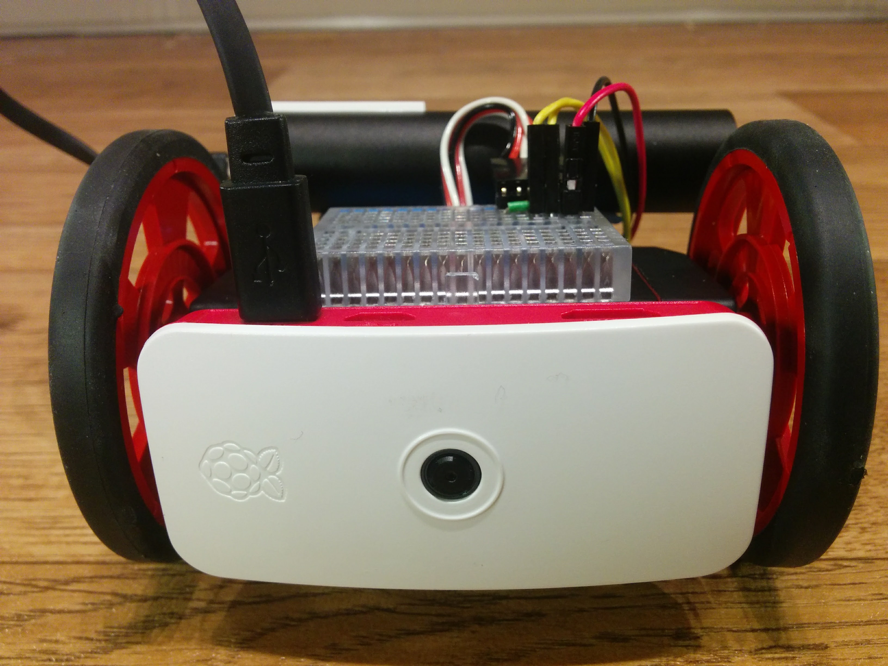
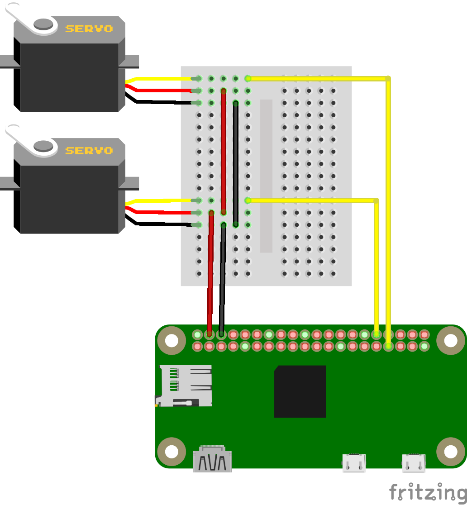

---
aliases:
- /pi-zero-w-rover-setup/
- /posts/pi-zero-w-rover-setup/
date: '2017-03-08T13:03:47Z'
description: Configure the pi zeros usb serial, networking and hardware pwm pins to
  control a servo wirelessly
draft: false
gallery:
- /blog/pi-zero-w-rover-setup/rover-01.jpg
- /blog/pi-zero-w-rover-setup/rover-02.jpg
- /blog/pi-zero-w-rover-setup/rover-03.jpg
- /blog/pi-zero-w-rover-setup/rover-04.jpg
- /blog/pi-zero-w-rover-setup/rover-05.jpg
- /blog/pi-zero-w-rover-setup/rover-06.jpg
slug: pi-zero-w-rover-setup
tags:
- linux
- robot
- serial
- raspberry-pi
- pwm
sidebar:
- /blog/pi-zero-w-rover-setup/
- /blog/custom-rpi-image-with-github-travis/
- /blog/rust-powered-rover/
- /blog/rover-refactor/
- /blog/rover-rest-api/
- /blog/rover-web-ui/
---

# Pi Zero W Rover Setup

The raspberry pi zero w has just been released and I managed to get my hands on
one before they sold out. This has sparked me to restart one of my old project
ideas of creating a wireless programmable rover platform. In this first post I
will talk about how to setup the pi and hook it up to the servos, in particular
how to configure the usb serial and enable and control the hardware pwm pins.

This post will be based off [archlinux arm] rather than raspbian as my distro
of choice but with some tweaks should work equally well on both distros. For
those that want to follow along with arch you should first follow my
[archlinuxarm setup guide] we will be adding a few steps to the end of the
[customisation stage]. You can also follow along from a running pi if you have
raspbian.


<!-- gallery(gallery="/blog/pi-zero-w-rover-setup/rover-01.jpg|/blog/pi-zero-w-rover-setup/rover-02.jpg|/blog/pi-zero-w-rover-setup/rover-03.jpg|/blog/pi-zero-w-rover-setup/rover-04.jpg|/blog/pi-zero-w-rover-setup/rover-05.jpg|/blog/pi-zero-w-rover-setup/rover-06.jpg") -->

[archlinux arm]: https://archlinuxarm.org/
[archlinuxarm setup guide]: /blog/raspberry-pi-archlinuxarm-setup
[customisation stage]: /blog/raspberry-pi-archlinuxarm-setup#install-and-configure-your-install

## The hardware

The only required components are a couple of [continuous rotation servo], ie
servos that have been modified to run continuously rather then to a fixed
angle, some [wheels] , a [5v battery] and something to hold it all together.
And of course the [raspberry pi zero w].

The wiring is straight forward, connect both grounds of the servos to one of
the [ground pins] on the pi and both the power pins to one of the [5V pins].
Then connect one of the signal wires to [GPIO12] and the other to [GPIO13].

 <!-- TODO height="400px" -->

You should note that the servos can draw quite quite allot of power when
running, the pi is fine with this as long as your power supply is able to supply
enough power for both the pi and the servos, usually more then about 1.5A.

As for the chassis I simple reused one from an old project, but it is little
more then the servos bolted back to back with the pi and a caster wheel
bluetacked on. I plan to design and 3d print a better case at a later date once
I have a better idea of all the components/sensors I want to add to it.

[continuous rotation servo]: http://www.robotshop.com/uk/parallax-futaba-continuous-rotation-servo.html
[wheels]: http://www.robotshop.com/uk/solarbotics-diameter-servo-wheel-red.html?gclid=CjwKEAiAi-_FBRCZyPm_14CjoyASJAClUigOzLcyvxUhK-8n7cYZY5af1UTnJn6hiMfivWQDZemPDRoCjGLw_wcB
[5v battery]: https://www.amazon.co.uk/gp/product/B00X9VKZIO/ref=oh_aui_detailpage_o00_s00?ie=UTF8&psc=1
[raspberry pi zero w]: https://thepihut.com/products/raspberry-pi-zero-w?variant=30333272081
[ground pins]: https://pinout.xyz/pinout/ground
[5V pins]: https://pinout.xyz/pinout/pin2_5v_power
[GPIO12]: https://pinout.xyz/pinout/pin32_gpio12
[GPIO13]: https://pinout.xyz/pinout/pin33_gpio13

## Configuring the pi

Once you are in the `chroot` of the image or logged into a running pi then its
time to configure our system. We need to enable two extra bits of functionally,
specifically enabling the usb serial interface, the hardware pwm pins and set up the
wireless network.

The usb serial is optional but makes connecting to and debugging the pi zero much
easier. All you need is a usb cable connected to your computer to gain
access to a full shell and it is simple to setup a wireless network or find out
the ip that has been assigned to the pi.

To enable the usb serial interface we need to add the `dwc2` overlay to the
config.txt and ensure the `g_serial` module is loaded during boot. Then ensure a
getty is listening to the serial port. All of which can be done by running the
following commands.

```bash
grep 'dtoverlay=dwc2' /boot/config.txt >/dev/null || echo 'dtoverlay=dwc2' >> /boot/config.txt
grep 'modules-load=dwc2,g_serial' /boot/config.txt >/dev/null || sed 's/.*/& modules-load=dwc2,g_serial' >> /boot/config.txt

ln -sf /usr/lib/systemd/system/getty@ttyGS0.service /etc/systemd/system/multi-user.target.wants/getty@ttyGS0.service
```

To connect to the pi zero over use serial you will need a program such as
`picocom`, `minicom`, `screen`, `putty`, or even the Arduino IDE. There are many
guides out there about how to do this so I will leave out the details in this
post. You can find out more about the other otg functionality of the pi
[here](https://learn.adafruit.com/turning-your-raspberry-pi-zero-into-a-usb-gadget/overview).

We want to be able to control two servos from the pi, luckily the pi contains
two hardware pwm pins which makes this much simpler. All we need to do is enable
them with the following.

```bash
grep 'dtoverlay=pwm-2chan,pin=12,func=4,pin2=13,func2=4' /boot/config.txt >/dev/null || echo 'dtoverlay=pwm-2chan,pin=12,func=4,pin2=13,func2=4' >> /boot/config.txt
```
Note that you can configure each pwm channel on one of 2 different pins. For
pwm0 you can use `GPIO12` or `GPIO18` and for pwm1 you can use `GPIO13` or
`GPIO19`. The command above configures our pi to use pins 12 and 13. You can
read more about the hardware pwms
[here](http://librpip.frasersdev.net/peripheral-config/pwm0and1/).

Lastly we want to configure the wireless so we dont need a cable attached in
order to interact with our robot.

```bash
# Enable wireless, actual connection details will be configured by the user, likely over usb-serial
ln -sf /usr/lib/systemd/system/wpa_supplicant@.service /etc/systemd/system/multi-user.target.wants/wpa_supplicant@wlan0.service

cat >/etc/systemd/network/wlan0.network <<EOF
[Match]
Name=wlan0
[Network]
DHCP=yes
EOF

cat <<EOF > /etc/wpa_supplicant/wpa_supplicant-wlan0.conf
ctrl_interface=/var/run/wpa_supplicant
ctrl_interface_group=wheel
update_config=1
fast_reauth=1
ap_scan=1
EOF

wpa_passphrase "SSID" "PASSPHRASE" >> /etc/wpa_supplicant/wpa_supplicant-wlan0.conf
```

You can install/configure anything else you might find useful at this point.

Now you can [finish of] and [flash the image to an sd card], or simply reboot
if your pi if you configure it while it was running.

[finish of]: /blog/raspberry-pi-archlinuxarm-setup#cleaning-up
[flash the image to an sd card]: /blog/raspberry-pi-archlinuxarm-setup#flash-the-image-to-an-sd-card

## Moving the robot

After you have gotten the pi up and running and connected to a wifi network or
otherwise have a shell running on it we can start to get it moving.

The hardware pwm pins are controlled by the sys filesystem located at
`/sys/class/pwm/pwmchip0`. Before we can do anything we must enable the pwm
channels, this can be done by writing the channel we want to enable to the
`export` file. Enable both channels with

```bash
echo 0 > /sys/class/pwm/pwmchip0/export
echo 1 > /sys/class/pwm/pwmchip0/export
```
This should create a couple of directories that will allow us to control each
servo independently, `/sys/class/pwm/pwmchip0/pwm0` and
`/sys/class/pwm/pwmchip0/pwm1`. Inside these directories we should have at least
three files, `period`, `duty_cycle` and `enable`.

The period is how often we send a pulse in nano seconds. A servo typically expects a pulse
every 20ms so we set the period to 20000000ns.

```bash
echo 20000000 > /sys/class/pwm/pwmchip0/pwm0/period
echo 20000000 > /sys/class/pwm/pwmchip0/pwm1/period
```

Servos move to their neutral point, stopped for continuous servos, when they
receive a pulse of 1.5ms, so we can set the duty cycle to this.

```bash
echo 1500000 > /sys/class/pwm/pwmchip0/pwm0/duty_cycle
echo 1500000 > /sys/class/pwm/pwmchip0/pwm1/duty_cycle
```

Finally we can enable the servos.

```bash
echo 1 > /sys/class/pwm/pwmchip0/pwm0/enable
echo 1 > /sys/class/pwm/pwmchip0/pwm1/enable
```

At this point the servos should be enable, and not moving. So lets make it drive
forward by setting one servo to go full forward and the other to go full reverse.

```bash
echo 1000000 > /sys/class/pwm/pwmchip0/pwm0/duty_cycle
echo 2000000 > /sys/class/pwm/pwmchip0/pwm1/duty_cycle
sleep 1
echo 1500000 > /sys/class/pwm/pwmchip0/pwm0/duty_cycle
echo 1500000 > /sys/class/pwm/pwmchip0/pwm1/duty_cycle
```

This will make the rover drive forward for 1 second then stop. If it
drives backwards then simply swap the servos around or reverse the numbers
above. If one or both servos do not move double check your wiring.

Try experimenting with different values, but values above `2000000` or below
`1000000` will just make the servo go in full forward or full reverse. Values
between these will make the servo move at various speeds between full reverse
and full forward.

Below is a simple script that encapsulates all of this and allows you you
program the rover to move in a set path, not much else but enough to get
started.

#### rover-test.sh
```bash
#!/bin/bash
set -uo pipefail
trap 's=$?; echo "$0: Error on line "$LINENO": $BASH_COMMAND"; exit $s' ERR
IFS=$'\n\t'

chip0=/sys/class/pwm/pwmchip0
pwm0=$chip0/pwm0
pwm1=$chip0/pwm1

pi_disable() {
    echo 0 > $pwm0/enable
    echo 0 > $pwm1/enable
    echo 0 > $chip0/unexport
    echo 1 > $chip0/unexport
}
trap pi_disable EXIT

pi_enable() {
    echo 0 > $chip0/export
    echo 1 > $chip0/export
    echo 20000000  > $pwm0/period
    echo 20000000  > $pwm1/period
    echo 1 > $pwm0/enable
    echo 1 > $pwm1/enable
}

pi_forward() {
    echo 1000000 > $pwm0/duty_cycle
    echo 2000000 > $pwm1/duty_cycle
}

pi_backward() {
    echo 2000000 > $pwm0/duty_cycle
    echo 1000000 > $pwm1/duty_cycle
}

pi_stop() {
    echo 1500000 > $pwm0/duty_cycle
    echo 1500000 > $pwm1/duty_cycle
}

pi_right() {
    echo 1000000 > $pwm0/duty_cycle
    echo 1000000 > $pwm1/duty_cycle
}

pi_left() {
    echo 2000000 > $pwm0/duty_cycle
    echo 2000000 > $pwm1/duty_cycle
}

pi_enable

while true; do
    pi_forward
    sleep 1
    pi_backward
    sleep 1
    pi_left
    sleep 1
    pi_right
    sleep 1
    pi_stop
    sleep 1
done
```

Save it to `rover-test.sh` then run it with

```bash
chmod +x rover-test.sh
sudo ./rover-test.sh
```

Press `ctrl+c` to stop it.

## Conclusion

You now have the start of a robotics platform, you can download a reconfigured
image
[here](https://github.com/mdaffin/rpizw-rover/releases/download/v0.1.0/rpizw-rover.img.xz)
so that all you need to do is give it the wireless credentials for your network.
This is only the foundation for a larger project: build a web controlled rover
but is necessary to get out the way before solving more intreating problems. In
my next few posts I hope to look at writing a rust webserver to run on the pi
that is able to control the rover then getting it to interact with the
environment in some way before looking into using the pi camera for vision
recognition.
